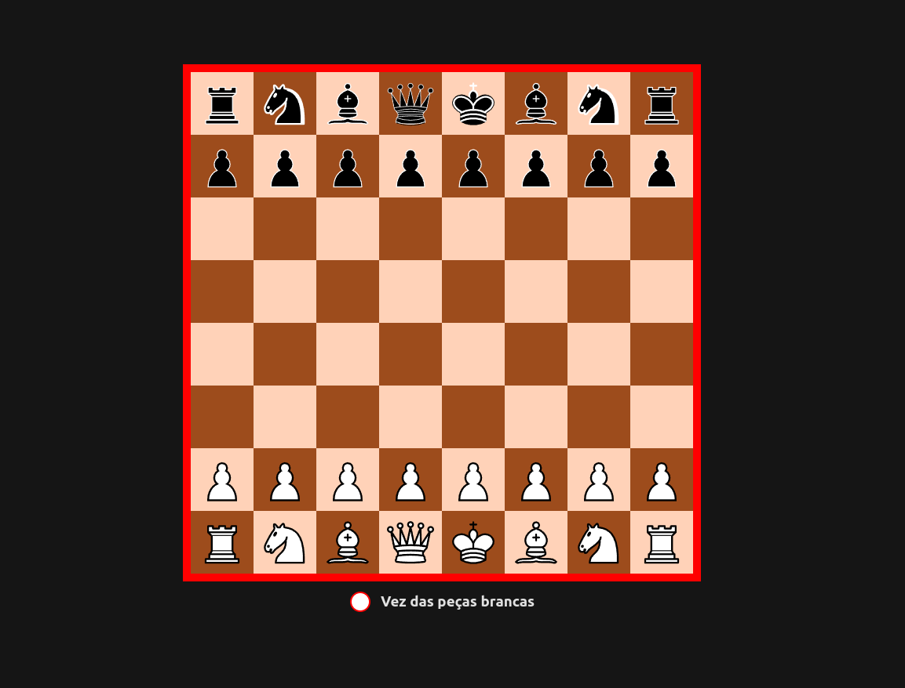

# Chess Game Application made with React and Typescript

This is a chess game created using react and typescript, in this application, you will be able to play chess with your friends. This app uses websockets to make tcp connection and both parts play the game in real time.

